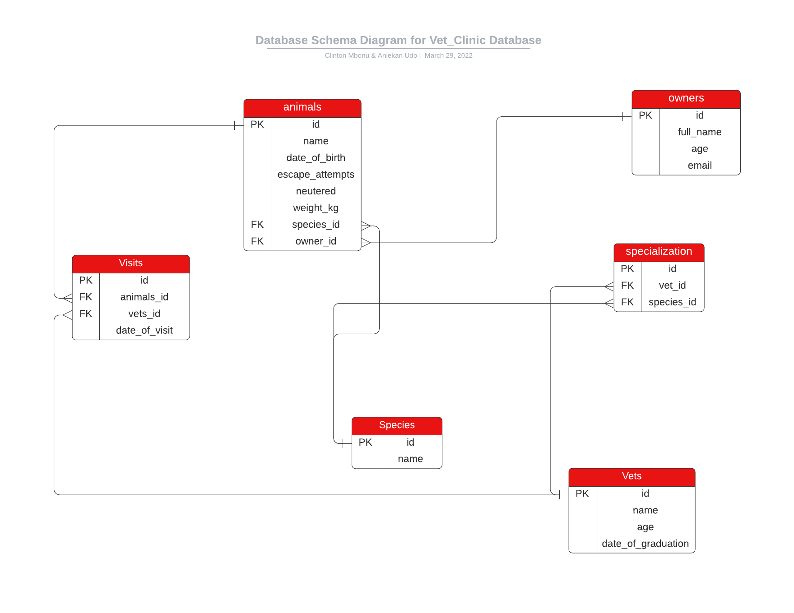

# Vet Clinic Database

> This repository implements the use of relational database to create the data structure for a vetima clinic. Implementing queries to create the animals table, insert data of animals and sql to query data that answer a few questions.

## Built With

- SQL
- PostgreSQL

## Getting Started

This repository includes files with plain SQL that can be used to recreate a database:

- Use [schema.sql](./schema.sql) to create all tables.
- Use [data.sql](./data.sql) to populate tables with sample data.
- Check [queries.sql](./queries.sql) for examples of queries that can be run on a newly created database. **Important note: this file might include queries that make changes in the database (e.g., remove records). Use them responsibly!**

## Authors

👤 **Clinton Mbonu**

- GitHub: [@clintonjosephs](https://github.com/clintonjosephs)
- LinkedIn: [LinkedIn](https://linkedin.com/in/clinton-mbonu)
- Twitter: [@clintonmbonu2](https://twitter.com/clintonmbonu2)

👤 **Aniekan udo**

- GitHub: [@Anny85-code](https://github.com/Anny85-code)
- Twitter: [@Annyudo8](https://twitter.com/Anny_udo8)
- LinkedIn: [LinkedIn](https://www.linkedin.com/in/aniekan-udo-665b65213/)

## 🤝 Contributing

Contributions, issues, and feature requests are welcome!

Feel free to check the [issues page](../../issues/).

## Show your support

Give a ⭐️ if you like this project!

## Acknowledgments

- Hat tip to anyone whose code was used
- Inspiration
- etc

## 📝 License

This project is [MIT](./MIT.md) licensed.
